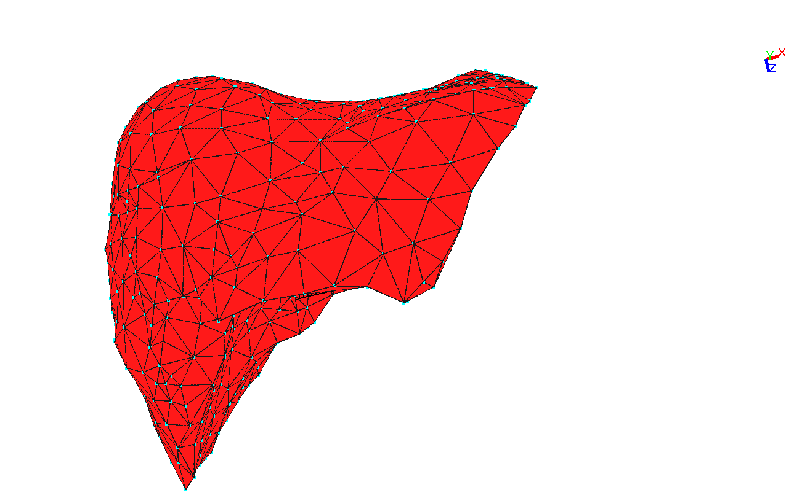
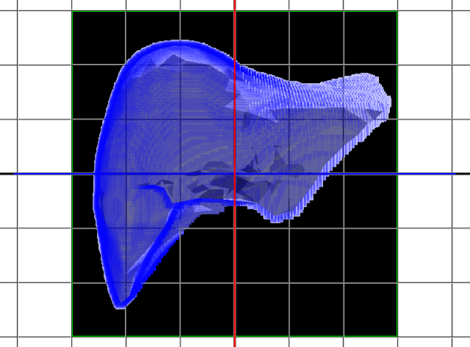

EIT v0.0.0
====

## Overview

This project is for viewing, editing, and converting 3D models using OpenGL.

## Projects

	MeshFromImage: Create mesh from image or video capture.
	MeshViewer: Model viewer.
	VectorMatrix: Vector class sample.

## Requirement

- LIB: freeglut, tetgen, opencv
- PATH: anywhere (default: ../data)

## Format

- Supported 3D model format: obj, stl, fem(original), vox(original)

## Sample command

	load:../data/sample.stl
	cvt:stl2fem
	save:../data/sample.fem

## Licence

[MIT](https://github.com/yoshimoto56/eit/blob/master/LICENSE)

## Author

[yoshimoto56](https://github.com/yoshimoto56)
